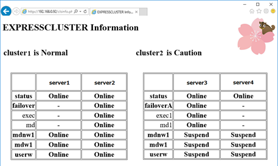

# Integrated Cluster WebUI by RESTful API

EXPRESSCLUSTER X 4.2 offers RESTful API service. It is running as HTTP Server on each server in the cluster.  
Users or applications can get various cluster status and can operate the cluster by HTTP / HTTPS request to RESTful API service.
Once RESTful API service receives an HTTP / HTTPS request, it returns the result as an HTTP response.  
This function can be utilized for consolidation of the management for multiple cluster systems like this sample of **Integrated Cluster WebUI**.



The scripts required for *Integrated Cluster WebUI* are attached to this document.  
In the following section describes how to use the sample scripts. 

### Configuration
```
 |
 |  +-----------------------------------+
 +--| EXPRESSCLUSTER X 4.2 for Windows  |
 |  | - 2node cluster		        +-----------+
 |  +-----------------------------------+	    |
 |						    |                                       
 |  +--------------------------------+              |
 +--| EXPRESSCLUSTER X 4.2 for Linux |    +---------+---------+       +--------------+
 |  | - 3node cluster                +----+                   |       |              |
 |  +--------------------------------+    | Integrated        |       |              |
 |                                        | Cluster WebUI     +-------+    Client    |
 |  +--------------------------------+    | Server            |       |              |
 +--| EXPRESSCLUSTER X 4.2 for Linux +----+                   |       |              |
 |  | - 2node cluster                |    +-------------------+       +--------------+
 |  +--------------------------------+
```


### Precondition
- EXPRESSCLUSTER X 4.2 (internal version 4.2.2-1 / 12.22 ～)
(RESTful API is available to 4.2.0-1 / 12.20. This book is for 4.2.2-1 / 12.22)
- need to install node.js for EXPRESSCLUSTER Server

### Setup EXPRESSCLUSTER X
Turn on the setting Cluster Properties > API tab > Enable API Service  
After select Communication Method(http or https), push the Apply the Configuration server.  
Default port number is 29009.  
If you want to edit port number, you have to edit Cluster Properties > Port No. > API HTTP Port Number.  

### How to use sample script
1. Install php and Apache for Integrated Cluster WebUI Server.    
2. Put sample scripts in the following configuration.  
 
```
var/
　└ www/
　   └ html/
         |- ecxinfo.php
         |- config.ini
         |- python
         |    |- cluster_cls.py
         |    |- cluster_grp.py
         |    |- cluster_grp_do_rsc.py
         |    |- cluster_mon.py
         |    |- cluster_rsc.py
         |    |- cluster_srv.py
         |
         |- image
              |- kurara.png
``` 
3. set cluster information to /www/var/html/config.ini.  
  - For example,
 
    | Parameters | Explanation |
    | ---- | ---- |
    | [1] | Section number |
    | method = http | select http or https |
    | user = test_user | set username to executing RESTful API |
    | pwd = test_pwd | set password to executing RESTful API |
    | host = 192.168.0.1 | set ipaddress to executing RESTful API |
    | port = 29009 | set port number to executing RESTful API |

4. enter the web browser  
    - http://IPaddress/ecxinfo.php
    	- IPaddress is Integrated Cluster WebUI Server's IPaddress.

### Notes
- For the section number specified in config.ini, make sure to specify a serial number starting from 1.
- If the parameters described in config.ini are incomplete, Integrated Cluster WebUI may not be displayed correctly.
- For the IP address specified in config.ini, specify only one of the IP addresses belonging to the cluster.

### Software / OS versions

- Integrated Cluster WebUI Server
    - Red Hat Enterprise Linux Server release 7.6 (Maipo)

- Apatch
```
Server version: Apache/2.4.6 (Red Hat Enterprise Linux)
Server built:   Jun 22 2018 01:19:25
```
- php
```
PHP 5.4.16 (cli) (built: Jun 19 2018 13:09:01)
Copyright (c) 1997-2013 The PHP Group
Zend Engine v2.4.0, Copyright (c) 1998-2013 Zend Technologies
```
- node.js 
    - v10.16.3
